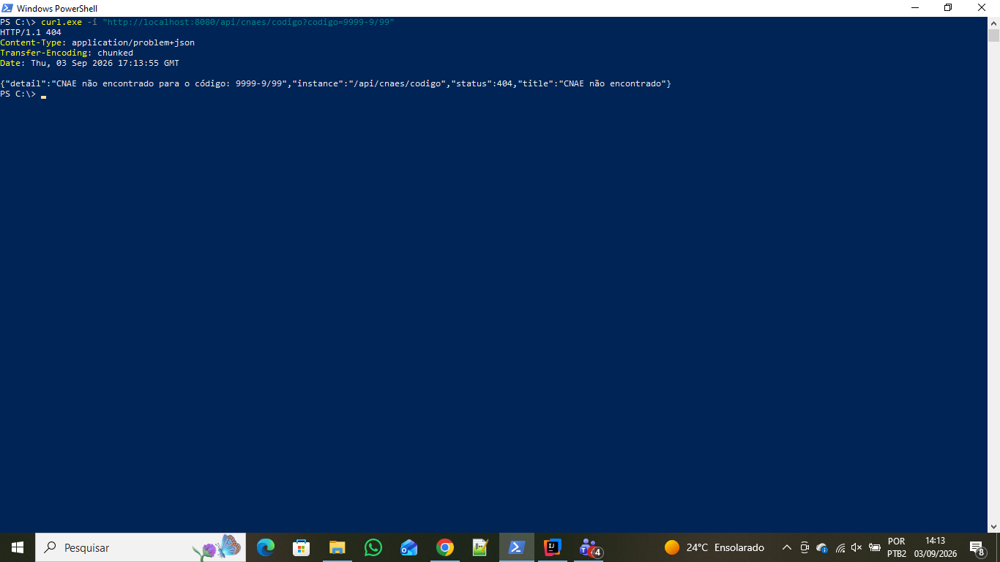

# Teste Técnico - Microserviço CNAE

Microserviço desenvolvido em Java 25 com Spring Boot 4.1.0 para consulta
de atividades econômicas CNAE e gerenciamento de cadastros secundários.

A solução foi revisada com foco em correção funcional, consistência das
regras de negócio, tratamento adequado de erros, testes automatizados e
manutenibilidade do código.

---

## Stack

- Java 25
- Spring Boot 4.1.0
- Spring Web
- Spring Data JPA
- H2 Database
- Lombok
- Maven
- JUnit 5
- Mockito

---

## Pré-requisitos

Para executar o projeto é necessário possuir:

- JDK 25
- Maven

Para validar o ambiente:

```bash
java -version
mvn -version
```

---

## Como executar

Na raiz do projeto:

```bash
mvn spring-boot:run
```

A aplicação ficará disponível em:

```text
http://localhost:8080
```

---

## Banco de dados H2

Console:

```text
http://localhost:8080/h2-console
```

Configuração:

```text
JDBC URL: jdbc:h2:mem:cnaedb
User: sa
Password:
```

O banco é executado em memória e os dados iniciais são carregados durante
a inicialização da aplicação.

---

## Endpoints

### Listar todos os CNAEs

```http
GET /api/cnaes
```

Retorna todas as atividades econômicas cadastradas.

Exemplo:

```bash
curl http://localhost:8080/api/cnaes
```

---

### Buscar CNAEs por descrição

```http
GET /api/cnaes/buscar?termo={texto}
```

Realiza busca parcial na descrição do CNAE.

A busca:

- encontra o termo em qualquer parte da descrição;
- ignora diferenças entre letras maiúsculas e minúsculas.

Exemplo:

```bash
curl "http://localhost:8080/api/cnaes/buscar?termo=programas"
```

---

### Buscar CNAE por código

```http
GET /api/cnaes/codigo?codigo={codigo}
```

Exemplo:

```bash
curl "http://localhost:8080/api/cnaes/codigo?codigo=6201-5/01"
```

Quando o CNAE existe:

```http
HTTP/1.1 200 OK
```

Quando o código informado não existe:

```http
HTTP/1.1 404 Not Found
```

---

### Listar cadastros secundários

```http
GET /api/cadastros-secundarios
```

Exemplo:

```bash
curl http://localhost:8080/api/cadastros-secundarios
```

---

### Validar CNAE para cadastro

```http
GET /api/cadastros-secundarios/validar-cnae?codigoCnae={codigo}
```

Exemplo:

```bash
curl "http://localhost:8080/api/cadastros-secundarios/validar-cnae?codigoCnae=6201-5/01"
```

Um CNAE inexistente não é considerado válido para associação a um
cadastro secundário.

---

### Criar cadastro secundário

```http
POST /api/cadastros-secundarios
```

Exemplo:

```bash
curl -X POST http://localhost:8080/api/cadastros-secundarios \
  -H "Content-Type: application/json" \
  -d '{"nomeFantasia":"Tech Porto","documento":"12345678000199","codigoCnae":"6201-5/01"}'
```

Quando o CNAE informado existe, o cadastro é realizado normalmente:

```http
HTTP/1.1 201 Created
```

Caso o CNAE não exista, o cadastro é recusado e nenhuma informação é
persistida.

---

# Objetivo da solução

O objetivo da implementação foi analisar o comportamento existente do
microserviço, identificar inconsistências em relação aos requisitos
solicitados e realizar as correções necessárias preservando a estrutura
original do projeto sempre que possível.

A solução priorizou:

- correção das regras de negócio;
- respostas HTTP coerentes;
- prevenção de persistência de dados inconsistentes;
- redução de duplicação;
- testes automatizados;
- alterações simples e de fácil manutenção.

---

# Diagnóstico e correções realizadas

## 1. Busca parcial de CNAE

### Problema

A consulta original utilizava o wildcard somente após o termo informado:

```sql
LIKE 'termo%'
```

Dessa forma, apenas descrições iniciadas pelo termo eram encontradas.

Por exemplo, uma pesquisa por:

```text
programas
```

não encontrava corretamente:

```text
Desenvolvimento de programas de computador sob encomenda
```

### Causa raiz

A implementação da consulta não correspondia ao requisito de localizar o
termo em qualquer parte da descrição.

### Correção

A consulta foi alterada para utilizar wildcard antes e depois do termo:

```sql
LIKE '%termo%'
```

A utilização de `LOWER()` foi mantida para garantir comparação
case-insensitive.

Com isso, pesquisas utilizando:

```text
programas
PROGRAMAS
Programas
```

possuem comportamento equivalente.

---

## 2. Consulta de CNAE inexistente

### Problema

Quando um código CNAE não era encontrado, a implementação original
retornava o primeiro CNAE disponível no banco.

O comportamento ocorria devido ao fallback:

```java
repository.findAll().getFirst()
```

### Impacto

Uma requisição utilizando um código inexistente poderia receber um
CNAE diferente daquele solicitado.

Além de violar o contrato da API, esse comportamento mascarava erros de
entrada e poderia induzir consumidores do serviço a utilizar informações
incorretas.

### Correção

O fallback foi removido.

Quando um CNAE não é localizado, o serviço passa a lançar:

```java
CnaeNotFoundException
```

O tratamento HTTP foi centralizado utilizando:

```java
@RestControllerAdvice
```

e a API retorna:

```http
HTTP/1.1 404 Not Found
```

A resposta utiliza `ProblemDetail`, mantendo o tratamento de erro
centralizado e separado das regras de negócio.

---

## 3. Cadastro secundário com CNAE inexistente

### Problema

Durante a criação de um cadastro secundário, caso o CNAE informado não
existisse, a implementação também utilizava o primeiro CNAE disponível
no banco.

### Impacto

Isso permitia que um cadastro fosse persistido associado a um CNAE
diferente daquele enviado na requisição.

Esse comportamento poderia gerar inconsistência de dados, pois uma
requisição inválida aparentemente seria processada com sucesso.

### Correção

A existência do CNAE passou a ser obrigatória antes da persistência do
cadastro.

Caso o código não seja localizado:

```java
CnaeNotFoundException
```

é lançada e:

```java
repository.save(...)
```

não é executado.

Assim, um cadastro inválido não é persistido.

---

## 4. Duplicação da regra de busca de CNAE

### Problema

Os fluxos de cadastro e validação possuíam métodos diferentes para
localização do CNAE, apesar de aplicarem a mesma regra.

Isso criava duplicação e permitia que os comportamentos divergissem
futuramente.

### Correção

A busca foi centralizada no método:

```java
buscarCnae(String codigoCnae)
```

Esse método passou a ser utilizado pelos fluxos:

```text
cadastrar()
    |
    +--> buscarCnae()

validarCnae()
    |
    +--> buscarCnae()
```

Com isso, cadastro e validação utilizam exatamente a mesma regra para
determinar se um CNAE existe.

---

# Decisões técnicas

## Preservação da arquitetura existente

A arquitetura existente:

```text
Controller
    ↓
Service
    ↓
Repository
    ↓
H2
```

foi mantida.

Para o escopo apresentado, essa estrutura é suficiente e evita a
introdução de complexidade sem benefício direto para o problema.

Não foram adicionadas abstrações arquiteturais desnecessárias.

---

## Tratamento centralizado de exceções

O tratamento de erros HTTP foi separado das regras de negócio através de:

```java
@RestControllerAdvice
```

Dessa forma, os serviços trabalham com exceções de domínio enquanto a
camada HTTP fica responsável pela tradução dessas exceções em respostas
adequadas.

---

## CNAE inexistente não possui fallback

Foi removida a estratégia de substituir silenciosamente um CNAE
inexistente por outro registro.

Um código inexistente agora representa explicitamente uma condição de
recurso não encontrado.

Essa decisão evita mascaramento de erros e possíveis inconsistências de
dados.

---

## Reutilização da regra de busca

A localização e validação de existência do CNAE foram centralizadas para
evitar duplicação.

Isso reduz a possibilidade de comportamentos diferentes entre cadastro e
validação.

---

## Escopo das alterações

As mudanças foram limitadas aos requisitos apresentados.

Não foram adicionadas regras de negócio não especificadas, evitando
alterações que poderiam mudar o contrato esperado da aplicação.

---

# Testes automatizados

Os testes podem ser executados através do Maven:

```bash
mvn clean test
```

A suíte automatizada cobre os principais fluxos positivos e negativos da
aplicação.

Entre os cenários validados estão:

- listagem de CNAEs;
- busca por descrição;
- busca parcial;
- busca case-insensitive;
- consulta de CNAE existente;
- consulta de CNAE inexistente;
- lançamento de `CnaeNotFoundException`;
- cadastro secundário com CNAE existente;
- tentativa de cadastro com CNAE inexistente;
- garantia de que cadastro inválido não seja persistido;
- validação de CNAE existente;
- validação de CNAE inexistente;
- listagem de cadastros secundários;
- resposta HTTP `404` para recurso inexistente.

Os testes foram divididos de acordo com a responsabilidade exercitada:

```text
src/test/java/com/porto/testecnae/
├── controller
├── repository
└── service
```

Caso exista o teste de integração completo:

```text
src/test/java/com/porto/testecnae/
└── integration
```

ele valida o fluxo:

```text
HTTP
 ↓
Controller
 ↓
Service
 ↓
Repository
 ↓
H2
```

---

# Evidências de execução

As evidências da execução final estão armazenadas em:

```text
docs/evidencias/
```

Foram registradas apenas evidências do comportamento final esperado da
aplicação.

---

## Aplicação inicializada

Execução:

```bash
mvn spring-boot:run
```


---

## Listagem de CNAEs

```bash
curl http://localhost:8080/api/cnaes
```


---

## Busca parcial por descrição

```bash
curl "http://localhost:8080/api/cnaes/buscar?termo=programas"
```

O termo é localizado mesmo quando aparece no meio da descrição.


---

## Consulta de CNAE inexistente

```bash
curl -i "http://localhost:8080/api/cnaes/codigo?codigo=9999-9/99"
```

Resultado:

```http
HTTP/1.1 404 Not Found
```



---

## Cadastro secundário válido

Exemplo:

```bash
curl -X POST http://localhost:8080/api/cadastros-secundarios \
  -H "Content-Type: application/json" \
  -d '{"nomeFantasia":"Tech Porto","documento":"12345678000199","codigoCnae":"6201-5/01"}'
```

Resultado:

```http
HTTP/1.1 201 Created
```


---

## Cadastro com CNAE inexistente

Um cadastro utilizando CNAE inexistente é recusado.

Resultado:

```http
HTTP/1.1 404 Not Found
```

Nenhum cadastro é persistido para o código inválido.


---

## Testes automatizados

Execução:

```bash
mvn clean test
```

Resultado esperado:

```text
BUILD SUCCESS
```


---

# Estrutura principal do projeto

```text
src/
├── main/
│   ├── java/com/porto/testecnae/
│   │   ├── controller/
│   │   ├── domain/
│   │   ├── dto/
│   │   ├── exception/
│   │   ├── repository/
│   │   └── service/
│   └── resources/
│       ├── application.properties
│       └── data.sql
│
└── test/
    └── java/com/porto/testecnae/
        ├── controller/
        ├── repository/
        └── service/

docs/
└── evidencias/
```

---

# Execução final

Para iniciar a aplicação:

```bash
mvn spring-boot:run
```

Para executar toda a suíte de testes:

```bash
mvn clean test
```